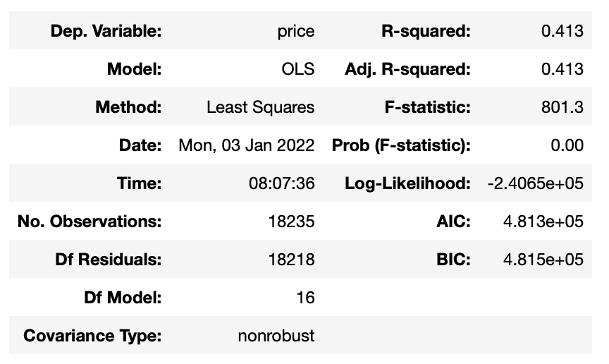
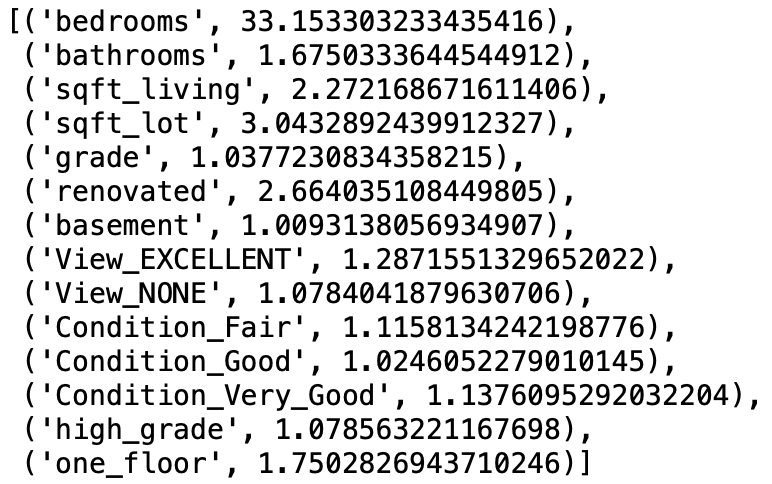

# Business Data and Understanding

Magical Homes Real Estate is a local agency looking to take a data driven approach to advising home owners on how to increase the sale price of their home.

This project will analyze a current dataset that captures unique information about specific houses and the sale price of that home in King County, Washington State. 

The object of the analysis will be use the data to build a model that will enable us to understand how different variables affect the sale price of the home and relay that information to home owners through easy to understand visualization. 

## Data and Methods Summary

1. Clean the dataset: 
- Deal with null values
- Remove extreme outliers to reflect a dataset that would not be skewed by luxury homes
- Remove unwanted variables (ex. Home ID)

2. Prepare the data for modeling:
- Run a correlation check to understand how variables correlate to sale price
- Normalize the data
- Convert categorical values

3. Explore the Data
- Use plots to confirm assumptions of normality and linear relationships
- Use this understanding to build new data features 
- Evaluate potential for multicollinearity in the final cleaned dataset

4. Modeling
- Create a baseline model with the top 3 highest correlating values found in section 2a
- Iterate the model by removing values that don’t score well and adding new ones to the model
- Remove any variables that are confirmed as multilinear through VIF scoring

5. Interpret the coefficients of the final model

# Data Cleaning

### Dealing with Null Values

Analyze null values and either remove or update that values to create a cohesive data set. 

### Dealing with Outliers

The real estate agency would like to advise as many home owners as possible on how they can use renovations to increase property values. 

In order to do that, we'll have to remove extreme values from the data set since we are not in skewing the data set. 

### Data Review

I want to evaluate which variables impact the price of the more than others, so that I can make reccommendations to home owners on which home renovations will yield a higher sale price. Because of this, I'll drop variables that I assume will have little impact on renovations.

Data to Drop:

ID: represents a unique identifer of the house and has nothing to do with attributes or price

Lat, Long, Zipcode: I'll assume that I cannot change the location of the home, so I won't use these features

Date: the date that the house was sold is likely irrelevant to the overall price of the home post renovation

sqft_living15 and sqft_lot15: This data point relies on neighbor data and is not relevant when evaluating renovations

sqft_above: I'll use the already included feature sqft_living as a way to gauge a change in price so that the owner can decided if they want to increase the overall living space

Finally, I'll evaluate any other variables that may need to be manipulated in any way. 

### Renovation vs. Price Data

Since we're interested in how renovations may affect the price of the home, let's compare the sale price of homes that were renovated vs not renovated and see if this confirms that renovating a home may increase the sales price of the house. 

# Prepare Data for Modeling

### Correlation Check

Run an initial check on correlations to see which variables we should start building the model with. 

The data above tells me that we should start our baseline model with the highest 
correlated values, I'll begin with grade, sqft_living and bathrooms. 

I've also noticed that yrs_since_built has a very low correlations with price. I'll look at the visualizations and consider removing this feature. 

### Normalizing Data

Normalize the numeric columns to the same scale and create a function to do so for future analysis. Data normalization is very important as it allows us to compare all of our data on the same scale and see which data sets have a greater impact on the model, even though they might be different relative sizes. 

Moving forward, I'll keep two separate copies of my data; one that has been normalized, and one that has not. This will allow me to compare coefficients with normalized data and extract real values based on those coefficiants from the data set that has not been normalized. 

### Dealing with Categorical Values

Using plots and considering the different variables, determine which values are categorical and must be manipulated by one hot encoding, and which are continuous.  

Continuous Variables:
- bedrooms
- bathrooms
- grade
- sqft_living
- sqft_lot
- yrs_since_built
- floors

Categorical Variables:
- view
- condition
- waterfront_binary
- renovated
- basement

Next we'll create the categories using pd.get_dummies
and add them to both the scaled and unscaled data sets

# Data Exploration

## Checking for Normality and Linearity

Observing the histograms above, most of the data seems to look rather normal, except for the following:

- yrs_since_built: much like the scatter plot and correlation value generated, this data looks randomly distributed
- grade: this variable appears to be bi-modal
- floors: this variable looks very heavily skewed

## Feature Building and Data Cleaning

In this section I'll remove the 'yrs_since_built' variable and make new features for grade and floors. 

Finally, we'll run the correlation check again to see if there were any changes. 

## Evaluating Multicolinearity

Multicolineartity could affect our resulting model, so we'll look for pairwise correlations that are higher than .65. 

I should be conscious that (one_floor,floor) and (sqft_living, bathrooms) may be colinear. 

As I noted above, it looks like the 'one_floor' feature is correlating a bit better with price than the 'floors' variable. Since one_floor and floors are so highly correlated, I'll drop floors from my modeling. 

# Modeling Data

## Baseline Model

Create a baseline model using the top three variables that correlated best with 'price'

Although we didn't get a very high R-squared score, the coefficients for the most correlated values suggest that grade, followed by sqft_living positively impact the price of the house. Adding more bathrooms may negatively affect the price. 

## First Iteration

Layer in the next three variables that correlated with 'price' which are bedrooms, one_floor and high_grade.

Although the model did not get that much stronger adding in the new variables increased the coefficiant for sqft_living, and bathrooms remained a negative coefficient. 

## Second Iteration

Add the next three most correlated values to sale price. 

The score has sligtly improved and we haven't seen much change the most highly correlating values. 

We do notice that there's a high p-value in view_good, we'll add the next set of variables to the model and remove view_good. 

## Third Iteration

Remove high p-value variable 'View_GOOD' and add next three highest correlating values. 

## Fourth Iteration

Let's add the final variables and remove the high p-score from the last model, 'View_FAIR'. 

## Fifth Iteration

Remove high p-values waterfront_binary condition_poor. 

## Investigate Multicolinearity Using VIF Scores

Finally, we'll use VIF scores to check the model for multicoliniearty. Any variable with a score greater than 10 we'll remove and re run the model. 

## Final Iteration

We found that the variable for bedrooms was affected the model, let's remove it and get our final model. 

# Conclusions and Future Work

Let's look at the final coefficients from the final model above. 

It appears that increasing the grade and condition of the house are the greatest contributors to an increase in the sale price of the house. Great news! These are things that buyers often have control over. 

Having a excellent view will also greatly contribute to the sale price, but I'll focus on this less when giving advice to the reality company as it's difficult for home owners to control. However, if the customer had a view that was blocked by trees on the property, we'd suggest to have them cut back. 

The third variable that we'll consider is the overall square footage of the living space. The data above suggests we can't merely add an extra bathroom to the house if it doesn't make sense with the over all size of the house. Homeowners should carefully consider how they can increase living space, either by adding on to the house or or changing the space to provide more functionality (screened in porch for example). 

## Conclusion

Let's use the coefficiants found above to put them into plain terms that will make it easier to speak with homeowners. 

Increasing the Condition: The overall condition of a home is related to the maintenance of the house. A 'good' condition denotes that the home requires no obvious maintenance and that appearance and utility are above standard; this condition will increase the sale price of the house by about 31.5 thousand dollars if no other variables about the house are changed. 

However, having a home with a 'very good' condition will increase the sale price by about 81.5 thousand dollars. Houses that are in 'very good' condition are very will maintained, and show that many things have been overhauled and repaired over time, greatly increasing the life expectancy and utility of the home. 

Increasing Grade: Grade is represented on a 1 to 13 scale with a grade of 6 achieving the lowest grade to meet current building codes. Grades 7 and above generally mean that the house has increasing architectural design, better construction and higher overall design quality. In simpler terms, this can denote the quality of cosmetic appearance such as wood finishings and bathroom fixtures. Remodeling a home to increase by 1 grade point will yield an increase in price of about 83 thousand dollars. 

Increasing square footage of living space: For every square foot of living space, the home will increase in value by about 72 dollars. A better rule of thumb would be to frame this in a larger scale; adding a wreck room or family room on to the house that adds 500 square feet of living room will increase the sale price of the home by about 36 thousand dollars. 

Next, a few visualaziations to help us discuss these variables with home owners:

## Future Work

- Acquire a new data set on the cost of different home renovations to be able to compare the cost of renovation vs the potential increase in sale price.
- Group data sets based on location and home cost to generate new models that have even better results based on home type.
- Take a predictive approach and build a model that can give homeowners an accurate representation of sale price when they make changes to their home .

